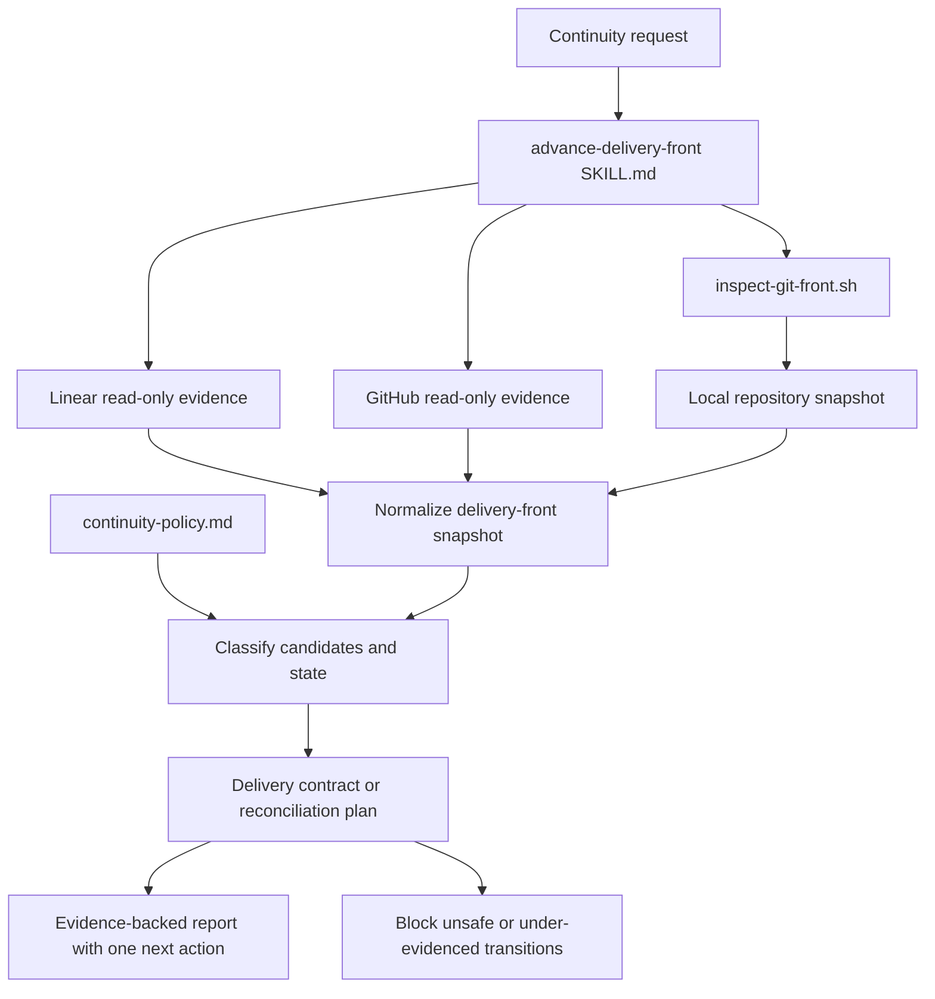

# Delivery Front Continuity Design

**Spec**: `.specs/features/delivery-front-continuity/spec.md`
**Status**: Approved

---

## Architecture Choice

### Recommended and selected: thin orchestrator plus deterministic Git collector

Keep `SKILL.md` focused on orchestration and safety, move the detailed state and classification
rules to one reference, and use one tested Bash script for the fragile local Git snapshot. Linear
and GitHub remain tool-driven, read-only inputs interpreted by the skill.

This approach was already present in the approved spec and is treated as selected by the user's
approval followed by authorization to continue into Design.

| Approach | Strengths | Costs | Decision |
| --- | --- | --- | --- |
| Thin skill + policy reference + Git collector | Concise trigger body, deterministic Git evidence, progressive disclosure, testable read-only boundary | Requires coordinating structured evidence from three sources | Selected |
| Prompt-only skill | Few files and no script maintenance | Repeats fragile Git commands, produces less consistent snapshots, weaker mutation guard | Rejected |
| Script-centric state engine | Strongly structured output and maximum deterministic classification | Over-engineers an MVP, couples external APIs to a local executable, duplicates agent reasoning | Rejected |

## Architecture Overview

The skill builds a point-in-time delivery-front model without persisting or mutating operational
state. It obtains issue and PR evidence through the tools available in the session and invokes the
bundled script only for local Git evidence. The policy reference defines how those snapshots become
classifications, delivery contracts and reconciliation plans.



The MVP has no write path. Any future branch, PR, Linear, rebase, push or force-push operation
requires a separately approved design revision.

## Source and Freshness Boundaries

| Source | Canonical responsibility | MVP access | Freshness evidence |
| --- | --- | --- | --- |
| Linear | Issue hierarchy, relations, status, owner and cycle order | Read-only session tool | Retrieval time plus issue update timestamp when available |
| GitHub | PR base/head, draft, review, CI, merge/closed state | Read-only session tool or `gh` query | Retrieval time plus current PR head SHA |
| Local Git repo | Worktree status, refs, ancestry, merge bases and changed paths | `inspect-git-front.sh` | Script capture time and resolved SHAs |
| Repo instructions/ADRs | Integration branch, merge strategy and local gates | Filesystem read | File path and current repository SHA |

Cross-source reads are not atomic. Before recommending promotion or reconciliation, the skill must
recheck that the PR head/base/state still match the snapshot. A local remote-tracking ref is not
claimed current unless a separate read-only remote query proves it; the MVP does not run `fetch`.

## Code Reuse Analysis

### Existing Components to Leverage

| Component | Location | How to use |
| --- | --- | --- |
| Evidence classes and comparative triage | `.agents/skills/triage-project-cycle/SKILL.md` | Reuse `FORMAL`, `INHERITED`, `CODE`, `INFERENCE`, `QUESTION`; accept its selected wave/candidates without duplicating full task preparation |
| Read-only Bash and functional-test pattern | `.agents/skills/create-review-bundle/scripts/` | Reuse strict shell mode, explicit argument validation, temporary Git fixtures and before/after worktree assertions |
| Product routing | `.agents/skills/portal-task-context/SKILL.md`, `.agents/skills/assistants-task-context/SKILL.md` | Hand off exactly one selected issue plus its delivery contract |
| Specification and execution lifecycle | `.agents/skills/tlc-spec-driven/SKILL.md` | Delegate single-task specification, implementation and verification; do not embed TLC workflow |
| Skill initialization and validation | `/root/.codex/skills/.system/skill-creator/scripts/` | Initialize the folder, generate `agents/openai.yaml`, and validate frontmatter/name |
| Workspace routing documentation | `README.md`, `AGENTS.md`, `.specs/STATE.md` | Register the new route and conform to AD-022 and existing canonical-source rules |

### Integration Points

| System | Integration method |
| --- | --- |
| `triage-project-cycle` | Consume comparison evidence or invoke it when several unprepared issues need cycle-level ordering |
| Product task-context skill | Pass selected issue, repo scope, classification, base contract and unresolved questions |
| `tlc-spec-driven` | Pass the prepared single issue; reassess the front after implementation, review or merge events |
| GitHub/Linear tools | Read only; tool absence creates an incomplete snapshot rather than a guessed safe transition |
| Nested product repositories | Run the bundled Git inspector against explicit repo paths after reading their local instructions |

## Components

### Skill Orchestrator

- **Purpose**: Resolve intent, gather the three evidence sources, apply the policy, and return exactly
  one safe next action.
- **Location**: `.agents/skills/advance-delivery-front/SKILL.md`
- **Interfaces**:
  - Request modes: `assess`, `select-next`, `prepare-contract`, `reassess-after-event`, inferred from
    the user's request rather than exposed as a CLI.
  - Input: delivery-front identity (project/cycle/issues), known PRs and repo scope; missing identity
    is requested only when it cannot be discovered safely.
  - Output: snapshot provenance, current topology, candidate verdicts, selected contract or blocked
    transition, and exactly one next action.
- **Dependencies**: Read access to the relevant source tools and explicit local repo paths.
- **Reuses**: Triage evidence model, product task-context routing and AD-022.
- **Boundary**: Never mutate Git, GitHub, Linear or product files.

### Continuity Policy

- **Purpose**: Hold detailed classification, WIP, state-transition, delivery-contract and
  reconciliation rules outside the trigger-critical skill body.
- **Location**: `.agents/skills/advance-delivery-front/references/continuity-policy.md`
- **Interfaces**:
  - Classification precedence: insufficient evidence or unresolved blocker → `blocked`; proven
    functional/base dependency → `dependent`; code overlap without dependency → `conflicting`;
    otherwise → `independent`.
  - State transition table matching the approved spec.
  - Templates for independent/dependent delivery contracts and post-merge plans.
  - Promotion guard requiring fresh base/head, task-only diff and applicable green gates.
- **Dependencies**: Approved spec and AD-022.
- **Reuses**: Evidence classes from `triage-project-cycle` without copying its issue-triage workflow.

### Git Front Inspector

- **Purpose**: Produce deterministic, structured local Git evidence without modifying the source
  repository.
- **Location**: `.agents/skills/advance-delivery-front/scripts/inspect-git-front.sh`
- **CLI**:
  - `--repo PATH` — required explicit Git repository.
  - `--integration-ref REF` — required comparison/integration ref.
  - `--work-ref REF` — optional, defaults to `HEAD`.
  - `--boundary-ref REF` — optional dependent-stack boundary.
  - `--captured-at TIMESTAMP` — optional injected timestamp for deterministic tests; defaults to UTC
    capture time and affects provenance only.
- **Output**: Stable tab-separated records with a schema version, capture time, repo root, branch,
  resolved work/integration/boundary SHAs, merge base, worktree entries, worktree list, changed paths,
  and task-only commits after the boundary when supplied. Dynamic values are escaped as Git-quoted
  fields so one record remains one line.
- **Exit behavior**: `0` for a complete snapshot; `2` for invalid arguments/ref/repo; no partial
  success code because source completeness is decided before emitting the snapshot.
- **Dependencies**: Bash, Git and standard POSIX utilities already used by workspace scripts.
- **Reuses**: Strict-mode and fixture-test patterns from `create-review-bundle`.
- **Forbidden commands/effects**: `fetch`, `pull`, `checkout`, `switch`, `branch`, `worktree add/remove`,
  `merge`, `rebase`, `reset`, `clean`, `stash`, `commit`, `push`, file writes in the repo, or writes
  to Git config/index/refs.

### Git Inspector Functional Tests

- **Purpose**: Prove output shape, ancestry/boundary behavior, error handling and source immutability.
- **Location**: `.agents/skills/advance-delivery-front/scripts/test-inspect-git-front.sh`
- **Scenarios**:
  - clean independent branch with deterministic resolved refs;
  - dirty tracked, untracked and deleted paths;
  - linked worktree visibility;
  - dependent branch with boundary-only commit list;
  - missing repo/ref/boundary rejection without partial output;
  - byte-for-byte Git status, refs and config unchanged before/after each successful and failed run.
- **Reuses**: Temporary repository harness from `test-create-review-bundle.sh`.

### Skill Interface Metadata

- **Purpose**: Expose a concise human-facing name, description and example invocation.
- **Location**: `.agents/skills/advance-delivery-front/agents/openai.yaml`
- **Interface values**:
  - `display_name`: `Advance Delivery Front`
  - `short_description`: `Continue delivery while PRs await review`
  - `default_prompt`: `Use $advance-delivery-front to assess my active PRs and recommend the next merge-safe task.`
- **Dependencies**: Generated with the skill-creator helper after `SKILL.md` is final.
- **Boundary**: Do not declare fixed MCP dependencies because the workspace may expose GitHub through
  different read-only surfaces; the skill handles missing tools explicitly.

### Workspace Route Registration

- **Purpose**: Make the continuity handoff visible without duplicating the skill's policy.
- **Location**: `README.md` and `AGENTS.md`.
- **Change**: Add the skill to the inventory/routing table and state that it owns active PR/task
  topology between triage, task context and TLC.
- **Dependencies**: Final validated skill contract.

## Data Models

These are conceptual report contracts, not persisted application types.

### DeliveryFrontSnapshot

```text
DeliveryFrontSnapshot
  captured_at
  scope: project | cycle | issue-set
  sources[]: {name, captured_at, freshness, available, evidence}
  repos[]: RepoSnapshot
  pull_requests[]: PullRequestSnapshot
  issues[]: IssueSnapshot
  inherited_rules[]
```

### RepoSnapshot

```text
RepoSnapshot
  path, head_sha, branch
  integration_ref, integration_sha, merge_base_sha
  worktree_dirty, worktree_entries[], linked_worktrees[]
  changed_paths[]
  boundary_ref?, boundary_sha?, task_only_commits[]
```

### CandidateAssessment

```text
CandidateAssessment
  issue
  classification: independent | dependent | conflicting | blocked
  confidence: high | medium | low
  evidence[]: {class, source, statement}
  affected_repos[]
  rejected_reason?
```

### DeliveryContract

```text
DeliveryContract
  issue, repo, work_branch
  base_sha, base_pr?, boundary_sha?
  initial_pr_base, final_pr_base
  linear_state, pr_state
  expected_paths[], gates[], promotion_conditions[]
  approvals_required[]
```

### ReconciliationPlan

```text
ReconciliationPlan
  trigger: base-merged | base-updated | base-closed
  snapshot_head_sha, current_head_sha
  boundary_sha?
  conceptual_git_operation
  before_after_checks[]
  blocking_conditions[]
  next_action
```

The `conceptual_git_operation` is explanatory text only in the MVP. It must never be executed by
the skill or inspector.

## Report Contract

Every result uses this order:

1. Scope and source freshness.
2. Current delivery-front topology per repo.
3. Candidate classification table with evidence class and confidence.
4. Selected delivery contract or blocked-transition explanation.
5. Reconciliation plan when an upstream PR event is in scope.
6. Exactly one recommended next action.
7. Explicit list of later actions requiring authorization.

If evidence is partial, the report says which conclusions remain valid and which transition is
blocked. It never turns missing evidence into `independent`.

## Error Handling Strategy

| Error scenario | Handling | User impact |
| --- | --- | --- |
| Linear or GitHub unavailable | Mark source unavailable and block classifications/transitions that depend on it | Receives a partial report and one evidence-recovery action |
| Product repo absent | Do not clone; mark Git evidence unavailable | Cannot receive a merge-safe recommendation for that repo |
| Worktree dirty | List affected paths and block only recommendations requiring branch switching there | Existing changes remain untouched |
| Invalid or missing Git ref | Inspector exits `2` without snapshot output | Skill asks for/refines the explicit ref |
| PR head/base changed during assessment | Mark snapshot stale and recollect affected source | No promotion recommendation from stale evidence |
| WIP cap already reached | Refuse a third front | Recommends completing/reconciling the existing second front |
| Boundary absent for dependent stack | Classify reconciliation evidence as incomplete | Blocks squash-aware promotion planning |
| Base PR closed without merge | Enter `abandoned-base` | Requires replanning; no automatic promotion |
| Unexpected task-base paths remain | Block promotion and list paths | Reviewer sees task-only integrity failure |

## Security and Mutation Controls

- Treat repository paths and refs as data; pass them as quoted arguments and terminate Git option
  parsing with `--` where paths are accepted.
- Do not print tokens, remote URLs containing credentials, Git config values or file contents.
- Capture names/status/ancestry only; changed file contents are not needed for the inspector.
- Test immutability using Git status, refs, config and source tree fingerprints before and after.
- Do not invoke `scripts/update-repos.sh` from this skill because it can switch branches and pull.
- Refuse to infer authorization for any state-changing follow-up from a read-only assessment.

## Risks & Concerns

| Concern | Location | Impact | Mitigation |
| --- | --- | --- | --- |
| Cross-source snapshot is non-atomic | GitHub, Linear and local Git integration | A PR can change between reads and invalidate a plan | Timestamp all sources and recheck PR head/base/state before promotion/reconciliation recommendations |
| Remote-tracking refs may be stale | Local Git repos under `repos/` | Local ancestry may not reflect the current integration branch | Report resolved local SHA and freshness limitation; use a separate remote read-only query when available; never fetch implicitly |
| Durable boundary metadata format remains undecided | Future PR draft metadata | A later session may lack the boundary needed after squash | MVP consumes an explicitly supplied/observed boundary and blocks otherwise; validate the marker format during the pilot before any PR-writing phase |
| Unusual Git path characters can corrupt line-oriented output | `inspect-git-front.sh` | Ambiguous parsing or missed dirty paths | Use NUL-delimited Git reads internally and Git-style quoting for stable one-record-per-line output; cover whitespace in tests |
| No workspace-wide test runner exists | Root workspace | Skill and scripts could drift independently | Add a co-located shell functional test, run ShellCheck when available, and run skill-creator `quick_validate.py` plus explicit content assertions |
| Triage and continuity responsibilities can overlap | `triage-project-cycle` and new skill | Duplicate analysis or contradictory ordering | Triage owns comparison/waves; continuity owns active PR topology, WIP and delivery/reconciliation contract |
| Fixed MCP declarations would be environment-specific | `agents/openai.yaml` | Skill may appear unavailable despite an alternative read surface | Keep interface metadata only and degrade explicitly when required read tools are absent |

## Tech Decisions

| Decision | Choice | Rationale |
| --- | --- | --- |
| Orchestration boundary | Agent combines sources; script inspects local Git only | Avoids coupling external APIs to a workspace script and preserves graceful degradation |
| Skill size | Thin `SKILL.md` plus one directly linked policy reference | Follows progressive disclosure and avoids duplicating detailed rules |
| Git output | Versioned line-oriented records with quoted dynamic fields | Easy for humans/agents to inspect and feasible in Bash without adding a JSON dependency |
| Timestamp injection | Optional `--captured-at` | Keeps runtime provenance while enabling deterministic tests |
| Persistence | None in MVP | Operational state remains canonical in Linear/GitHub/Git; unresolved durable metadata is not guessed |
| Mutation support | Explicitly absent | AD-022 approves read-only-first validation before automation of shared state |
| Assets | None | The skill produces reports, not reusable output files or media |

No additional project-level decision is introduced; the design conforms to active AD-022.

## Design Approval Record

Approved by the user on 2026-07-22. This approval authorizes creating `tasks.md` for the read-only
MVP. It does not authorize implementing the skill or performing any Git, GitHub or Linear mutation.
