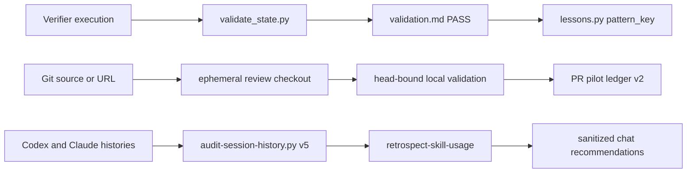

# Skill Behavior Retrospective Hardening Design

**Spec**: `.specs/features/skill-behavior-retrospective-hardening/spec.md`
**Status**: Approved

## Architecture Overview

The feature keeps each evidence boundary deterministic and narrow. TLC owns validation provenance
and lesson identity; the PR-review helper owns ephemeral SHA materialization and the sanitized
ledger; the session auditor owns engine-format parsing; the new skill owns interpretation and
routing but performs no mutation.



## Approach Selection

| Approach | Trade-off | Decision |
| --- | --- | --- |
| Keep prose-only discipline | No migration cost, but repeats the observed false-positive validation state | Rejected |
| Put all checks in the new retrospective skill | Centralizes diagnosis but detects failures only after completion | Rejected |
| Strengthen each owner and use one retrospective orchestrator | Prevents local invalid states and keeps interpretation reusable | Selected |

The selected approach follows the workspace pattern established by AD-033: deterministic scripts
measure or reject state, while skills retain contextual judgment.

## Code Reuse Analysis

### Existing Components to Leverage

| Component | Location | How to Use |
| --- | --- | --- |
| TLC completion parser | `.agents/skills/tlc-spec-driven/scripts/validate_state.py` | Extend the existing report gate with provenance fields and legacy scope. |
| Lessons store | `.agents/skills/tlc-spec-driven/scripts/lessons.py` | Add stable semantic identity ahead of existing exact/similarity fallbacks. |
| PR ledger validator | `scripts/pr-review-pilot.py` | Introduce schema-v2 checks while retaining schema-v1 parsing. |
| Review skill | `.agents/skills/review-pull-request/SKILL.md` | Promote the pilot and route exact-head local validation through the helper. |
| Session cohort scanner | `scripts/audit-session-history.py` | Parse skill evidence in the same accepted/excluded session pass. |
| Engine parity test | `scripts/test-skill-engine-parity.py` | Verify the new Codex manifest and Claude symlink automatically. |

### Integration Points

| System | Integration Method |
| --- | --- |
| TLC validation artifacts | Markdown fields parsed by `validate_state.py`; no external state. |
| Git | A new shell helper clones into an explicit empty destination and verifies exact objects. |
| Session histories | Read-only JSONL scanning with content-free aggregate output. |
| Codex/Claude discovery | `.agents/skills/retrospect-skill-usage` plus relative `.claude/skills` symlink. |

## Components

### Verifier Provenance Gate

- **Purpose**: Reject new PASS reports that do not state how verifier independence was achieved.
- **Location**: TLC `validate_state.py`, validation guidance, and deterministic gate tests.
- **Interface**: `validate_state.py [feature] --root <root>` remains compatible.
- **Data**: `Verifier mode`, `Verifier evidence`, and `Fallback reason` fields in `validation.md`.
- **Compatibility**: Only the named feature under active validation is held to the new contract;
  cross-check mode preserves historical reports that predate the adoption decision.

### Semantic Lesson Identity

- **Purpose**: Merge grounded restatements by a stable behavior pattern.
- **Location**: TLC `lessons.py`, its tests, and lessons guidance.
- **Interface**: `lessons.py add --pattern-key <kebab-case>` becomes mandatory for new writes.
- **Matching order**: same signal plus pattern key, exact legacy key, then calibrated similarity.
- **Compatibility**: Existing entries without `pattern_key` remain readable and matchable.

### Exact-Head Materializer

- **Purpose**: Produce a detached local checkout whose base/head identities are provable.
- **Location**: `.agents/skills/review-pull-request/scripts/materialize-review-head.sh`.
- **Interface**: explicit source, base SHA, head SHA, and empty destination.
- **Behavior**: clone without local hardlinks, verify both commit objects, detach at head, emit only
  destination/base/head metadata, and leave source porcelain byte-identical.
- **Network**: a URL source is allowed only after the caller obtains the separately required approval.

### Review Ledger v2

- **Purpose**: Distinguish a justified absence of local validation from unbound evidence.
- **Location**: `scripts/pr-review-pilot.py` and tests.
- **Model**: v2 adds `checks.local_reason` and `checks.local_head_sha`; reason is required for
  `unbound`, `not-run`, and `not-applicable`; exact final head is required for `passed`/`failed`.
- **Compatibility**: v1 records retain their prior summary semantics.

### Skill-Evidence Metrics

- **Purpose**: Count only engine-structured activations and explicitly label weaker proxies.
- **Location**: `scripts/audit-session-history.py` contract v5 and fixtures.
- **Model**:
  - `skill_invocations` and `skill_invocation_sessions`: supported for Claude, unsupported for Codex;
  - `skill_load_proxies` and `skill_load_proxy_sessions`: content-free path-derived counters where
    the engine exposes tool input safely;
  - every unsupported metric remains `null` with a reason.
- **Privacy**: counters contain validated skill names only; prompts, commands, results, paths, and
  session identifiers are never emitted.

### Retrospective Skill

- **Purpose**: Turn a sanitized cohort into opportunity-aware recommendations.
- **Location**: `.agents/skills/retrospect-skill-usage/`.
- **Interfaces**: `SKILL.md`, Codex `agents/openai.yaml`, and Claude relative symlink.
- **Workflow**: require exact cwd, closed UTC window, current-session exclusion, receipt generation,
  relevant skill-contract inspection, opportunity classification, and chat-only report.
- **Boundary**: recommendations do not authorize implementing changes; a separate TLC workflow does.

## Data Models

### Validation provenance

```text
Verifier mode: independent-agent | standalone-fallback
Verifier evidence: non-placeholder bounded description
Fallback reason: required only for standalone-fallback
```

### Lesson identity

```json
{
  "signal": "surviving_mutant",
  "pattern_key": "exact-head-validation-binding",
  "features": ["feature-a", "feature-b"],
  "recurrence": 2
}
```

### Review checks v2

```json
{
  "remote": "passed",
  "local": "passed",
  "local_head_sha": "<40-hex final head>",
  "local_reason": null
}
```

## Error Handling Strategy

| Error Scenario | Handling | User Impact |
| --- | --- | --- |
| Missing verifier evidence | Completion gate exits 1 with the missing field | Feature remains incomplete. |
| Invalid pattern key | Lessons command exits 2 before loading or saving the store | No partial write. |
| Missing exact Git object | Materializer exits non-zero and does not claim a checkout | Review records an explicit limitation. |
| Incompatible review record | Ledger validator rejects it before append | Existing ledger remains unchanged. |
| Unsupported invocation metric | Auditor emits `null` plus reason | No false cross-engine comparison. |
| Missing current-session exclusion | Retrospective skill stops before interpretation | Current analysis cannot inflate its own evidence. |

## Risks & Concerns

| Concern | Location | Impact | Mitigation |
| --- | --- | --- | --- |
| Historical validation reports have no provenance schema | `.specs/features/*/validation.md` | A global hard requirement would invalidate the workspace retrospectively | Apply the new gate to explicit active-feature validation and preserve legacy cross-check compatibility. |
| Lesson text similarity can merge only lexical overlap | `.agents/skills/tlc-spec-driven/scripts/lessons.py` | Semantically equal lessons remain candidates | Require an explicit bounded pattern key for new grounded observations. |
| Local Git clone may resolve the wrong object | review materializer | Tests could support a different head | Verify full base/head commit IDs after clone and detach exactly at head. |
| Session prose contains injected skill catalogs | `scripts/audit-session-history.py` | Text search inflates usage | Count only `Skill` tool calls or exact tool-input path proxies; ignore message and output text. |
| A report can still lie about provenance | Markdown completion evidence | File validation cannot cryptographically prove agent identity | Require explicit evidence and add session-retrospective compliance checks; document that harness identity remains an external fact. |

## Tech Decisions

| Decision | Choice | Rationale |
| --- | --- | --- |
| Verifier enforcement | Deterministic report schema plus engine-history audit | Stronger than prose while acknowledging harness identity cannot be proven from Markdown alone. |
| Lesson recurrence | Explicit semantic pattern key | Reproducible, dependency-free, and safer than lowering similarity. |
| Review materialization | Isolated clone, not source worktree or worktree metadata | Preserves read-only review boundaries. |
| Skill metrics | Capability-specific fields with unsupported nulls | Maintains v4 symmetric semantics without false equivalence. |
| New skill | One narrow automatic skill, initially unrouted | Repeated workflow justifies one surface without recreating wrapper sprawl. |
