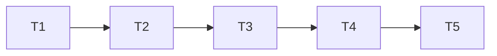

# TLC Spec-Driven 3.3.0 Upgrade Tasks

**Status:** Approved

## Test Coverage Matrix

| Layer | Required test | Coverage expectation | Command |
| --- | --- | --- | --- |
| Vendor merge | Provenance and retained-extension inspection | TLC330-01..03 | focused metadata/contract checks |
| Spec validator | CLI fixtures | TLC330-04 plus required-section and SHALL failures | `python3 scripts/test-tlc-deterministic-gates.py` |
| State validator | CLI fixtures | TLC330-05..06 including conflicting subordinate results | `python3 scripts/test-tlc-deterministic-gates.py` |
| Task/commit validators | CLI fixtures | TLC330-07..08 accept/reject behavior | `python3 scripts/test-tlc-deterministic-gates.py` |
| Workspace integration | Full root gate and disposable mutations | TLC330-09..12 | `bash scripts/test-workspace.sh` plus standalone sensor |

## Gate Check Commands

| Gate | Command |
| --- | --- |
| Quick | `python3 scripts/test-tlc-deterministic-gates.py` |
| Skill | Codex skill structural validator for `.agents/skills/tlc-spec-driven` |
| Full | `bash scripts/test-workspace.sh` |
| Integrity | `git diff --check` and reviewed exact commit range |

## Execution Plan

### T1 — Record the approved upgrade contract

- **Depends on:** none
- **Deliverable:** Approved specification, design, task graph, and prospective compatibility policy.
- **Files:** `.specs/features/tlc-spec-driven-3-3-upgrade/{spec,design,tasks}.md`
- **Tests:** Validate traceability for TLC330-01..12.
- **Gate:** `git diff --check`
- **Commit:** `docs(spec): plan TLC 3.3.0 upgrade`

### T2 — Merge the pinned upstream release

- **Depends on:** T1
- **Deliverable:** Upstream 3.3.0 content with all intentional local extensions retained.
- **Files:** `.agents/skills/tlc-spec-driven/**`, `.agents/vendor.json`
- **Tests:** Two-sided diff review, conflict-marker check, skill structural validation.
- **Gate:** Skill gate and `git diff --check`
- **Commit:** `chore(tlc): merge upstream 3.3.0`

### T3 — Harden and test deterministic gates

- **Depends on:** T2
- **Deliverable:** Compatible spec/state parsing and behavioral coverage for all four validators.
- **Files:** TLC validator scripts, `scripts/test-tlc-deterministic-gates.py`, root gate.
- **Tests:** Positive, negative, misleading-verdict, parity, and commit-message fixtures.
- **Gate:** Quick and Full gates.
- **Commit:** `test(tlc): harden deterministic gates`

### T4 — Record adoption and vendor evidence

- **Depends on:** T3
- **Deliverable:** Version documentation, AD-040 prospective policy, and updated handoff.
- **Files:** `README.md`, `.agents/vendor.json`, `.specs/STATE.md`, execution record.
- **Tests:** Metadata synchronization and decision/history integrity.
- **Gate:** Full and Integrity gates.
- **Commit:** `docs(workspace): adopt TLC 3.3.0 gates`

### T5 — Verify the delivered range

- **Depends on:** T4
- **Deliverable:** Fresh standalone validation report and killed-mutant evidence.
- **Files:** `.specs/features/tlc-spec-driven-3-3-upgrade/validation.md`, execution record.
- **Tests:** Full root gate from the functional commit plus disposable mutation sensor.
- **Gate:** Full and Integrity gates.
- **Commit:** `docs(validation): verify TLC 3.3.0 upgrade`

## Dependency Check

| Task | Depends on | Valid? |
| --- | --- | --- |
| T1 | none | Yes |
| T2 | T1 | Yes |
| T3 | T2 | Yes |
| T4 | T3 | Yes |
| T5 | T4 | Yes |

## Test Co-location Check

| Task | Behavioral change | Co-located test | Valid? |
| --- | --- | --- | --- |
| T2 | Vendored workflow content | Metadata and retained-contract assertions in focused harness | Yes |
| T3 | Validator parsing and verdict selection | CLI behavioral harness | Yes |
| T4 | Prospective adoption policy | Root gate and decision contract checks | Yes |

## Execution Record

| Task | Status | Commit / evidence |
| --- | --- | --- |
| T1 | Complete | `d138034` — contract and execution plan committed |
| T2 | Complete | 3.3.0 merged; bilateral review, provenance assertions, skill validation, and `git diff --check` passed |
| T3 | Pending | — |
| T4 | Pending | — |
| T5 | Pending | — |
