# Incrementos de Valor na TLC — Design

**Spec:** `.specs/features/value-oriented-tlc-increments/spec.md`
**Status:** Approved

## Architecture Overview

A implementação será uma customização focada do fork vendorizado definido pela AD-016. O contrato
comprovado no commit EDREN `47ff1fd` será portado por merge conceitual, não por cópia integral: o
schema e o ciclo de Value Increment entram na TLC, enquanto delegação, Verifier, engines e seleção de
modelo continuam regidos pela TLC local e pela AD-045.

```mermaid
flowchart LR
    S[Spec requirements] --> T[Atomic tasks]
    T --> P[Value Increment Plan]
    P --> V[validate_tasks.py]
    V --> E[Execute task gates]
    E --> H[Handoff while open]
    H --> G[Increment terminal gate]
    G --> C[One outcome commit]
    C --> F[Final Verifier]
    F --> R[Evidence-only closure]
```



O contrato é prospectivo conforme AD-040: planos novos ou materialmente revisados usam o schema
novo; artifacts históricos concluídos não recebem backfill nem certificação retroativa.

## Approach Selection

| Approach | Trade-off | Decision |
| --- | --- | --- |
| Customizar diretamente o fork vendorizado e cobrir a divergência com sensor determinístico | Mantém uma única TLC nos dois engines, mas aumenta a superfície de merge em upgrades upstream. | Chosen |
| Criar uma skill wrapper apenas para commits de valor | Reduz conflitos upstream, mas duplica Planning/Execute e cria duas fontes de verdade. | Rejected |
| Registrar a preferência somente em `AGENTS.md` | É simples, mas deixa schema, parser, batching e verifier inconsistentes e sem fail-closed. | Rejected |

## Code Reuse Analysis

### Existing Components to Leverage

| Component | Location | How to Use |
| --- | --- | --- |
| Parser de tasks | `.agents/skills/tlc-spec-driven/scripts/validate_tasks.py` | Estender o parser existente com tabela e ownership `VI-NNN`. |
| Validador Conventional Commits | `.agents/skills/tlc-spec-driven/scripts/check_commit.py` | Preservar comportamento; mudar somente a semântica documentada para outcome predominante. |
| Contratos comportamentais TLC | `scripts/test-tlc-deterministic-gates.py` | Atualizar fixtures vivas para o schema prospectivo sem varrer specs históricas. |
| Gate agregado | `scripts/test-workspace.sh` | Incluir exatamente uma nova suíte de Value Increment. |
| Registry de fork | `.agents/vendor.json` | Registrar a customização e seu sensor para merges de três vias. |
| Handoff freshness | `scripts/workspace-handoff.py`, AD-046 | Usar Handoff como checkpoint do incremento aberto e evidence-only closure após o commit comportamental. |
| Implementação comprovada | EDREN `47ff1fd` | Reusar schema e invariantes, removendo regras Codex-only/single-agent/modelo fixo. |

### Integration Points

| System | Integration Method |
| --- | --- |
| Specify/Design | Requisitos continuam sendo a fonte do outcome e da traceability. |
| Tasks | Nova tabela `Value Increment Plan` e campo `Value Increment` por tarefa. |
| Execute | Task gate fecha tarefa; terminal gate fecha incremento; Handoff cobre o intervalo. |
| Delegation | Packing continua por fases, mas o boundary se ajusta para não dividir incremento. |
| Verifier | Executa após o último incremento comportamental e produz evidence-only closure. |
| Vendored updates | Sensor e registry tornam a divergência local explícita no three-way merge. |

## Components

### Value Increment Schema

- **Purpose:** representar uma unidade de outcome, gate e rollback independente da granularidade das tarefas.
- **Location:** `.agents/skills/tlc-spec-driven/references/tasks.md`
- **Interface:** tabela com `Value Increment`, `Outcome`, `Requirements`, `Tasks`, `Terminal Gate`, `Rollback Boundary`, `Proposed Commit`; campo `Value Increment` em toda tarefa.
- **Dependencies:** requirement IDs do spec, tarefas ordenadas e comandos reais do gate.
- **Reuses:** Test Coverage Matrix, Gate Check Commands e Conventional Commits existentes.

### Deterministic Validator

- **Purpose:** falhar fechado para schema ausente, campo vazio, ID inválido, task desconhecida, ownership duplicado ou divergente.
- **Location:** `.agents/skills/tlc-spec-driven/scripts/validate_tasks.py`
- **Interface:** `check(tasks_path)` e CLI existentes permanecem; a validação nova é default prospectivo.
- **Dependencies:** parser Markdown heurístico atual.
- **Reuses:** `TASK_RE`, `EDGE_RE`, `check_commit.py` semantics e exit codes existentes.

### Execution Contract

- **Purpose:** alinhar status, Handoff, gate terminal, commit, batching e Verifier na mesma máquina de estados.
- **Location:** `.agents/skills/tlc-spec-driven/SKILL.md`, `references/implement.md`, `references/memory.md`, `references/sub-agents.md`, `references/validate.md`.
- **Interface:** `task_open -> task_green -> increment_open -> terminal_green -> increment_committed -> verifier`.
- **Dependencies:** autorização local existente e AD-046 para freshness/evidence-only descendants.
- **Reuses:** adequacy review, discrimination sensor, fix-to-reverify e blast radius atuais.

### Workspace Regression Sensor

- **Purpose:** provar o schema positivo/negativo e impedir regressão textual para task-to-commit ou importação EDREN-only.
- **Location:** `scripts/test-tlc-value-increments.py` e `scripts/test-workspace.sh`.
- **Interface:** suíte Python sem rede, integrada uma vez ao gate agregado.
- **Dependencies:** skill e registry locais.
- **Reuses:** padrão de fixtures isoladas de `scripts/test-tlc-deterministic-gates.py`.

## Data Models

### ValueIncrement

```text
ValueIncrement {
  id: VI-NNN
  outcome: non-empty text
  requirements: non-empty requirement references
  tasks: non-empty unique set<Tn>
  terminal_gate: non-empty command or named gate
  rollback_boundary: non-empty text
  proposed_commit: valid Conventional Commit
}
```

Invariants:

- Cada tarefa formal possui exatamente um owner `VI-NNN`.
- Toda tarefa citada pelo plano existe e toda tarefa existente aparece no plano.
- O ID e a mensagem proposta são sintaticamente válidos.
- O schema não tenta provar semanticamente que outcome e rollback são bons; tasks approval e
  Verifier continuam responsáveis por esse julgamento.

## Error Handling Strategy

| Error Scenario | Handling | User Impact |
| --- | --- | --- |
| Seção ou tabela ausente | `validate_tasks.py` retorna erro antes de tasks approval. | Plano é corrigido antes de Execute. |
| Campo vazio ou commit inválido | Erro identifica `VI-NNN` e campo. | Sem ambiguidade sobre a correção. |
| Task sem owner, duplicada ou desconhecida | Erro identifica task e owners conflitantes. | Incremento não pode iniciar. |
| Gate de tarefa falha | Task e incremento permanecem abertos; Handoff registra estado. | Nenhum commit parcial. |
| Gate terminal falha | Incremento permanece não concluído. | Outcome não entra no Git. |
| Gap do Verifier antes de publicação | Corrigir dentro do incremento/fechamento ainda não publicado e revalidar. | História local continua coesa. |
| Gap após publicação | Novo incremento auditável. | História remota não é reescrita. |
| Upgrade upstream remove a customização | Sensor do gate falha e registry orienta o merge. | Regressão é explícita antes da adoção. |

## Risks & Concerns

| Concern | Location | Impact | Mitigation |
| --- | --- | --- | --- |
| Parser Markdown é heurístico | `.agents/skills/tlc-spec-driven/scripts/validate_tasks.py:1` | Variações de tabela/campo podem passar ou falhar incorretamente. | Schema canônico exato e fixtures positivas/negativas para cada boundary. |
| Fixtures vivas ainda usam task-to-commit | `scripts/test-tlc-deterministic-gates.py:1` | O gate pode validar o contrato antigo sem perceber. | Migrar somente fixtures prospectivas e adicionar sensor específico; não varrer artifacts históricos. |
| Value Increment pode ser usado para tarefas não relacionadas | `references/tasks.md` | Commits grandes e pouco reversíveis substituem microcommits. | Exigir outcome compartilhado, terminal gate e rollback boundary; Tasks review continua julgando coesão. |
| Batch de subagente pode cortar um incremento | `references/sub-agents.md:1` | Um worker deixaria valor incompleto para outro contexto. | Ajustar boundary de batch e cobrir a instrução no sensor. |
| Cópia integral do EDREN conflita com AD-045 | EDREN `47ff1fd` | Perda de dual-engine/delegação/verifier atual. | Sensor exige contratos locais e rejeita marcadores EDREN-only. |
| Evidência final nasce após o commit comportamental | `references/validate.md:1` | Um commit documental adicional pode parecer microcommit. | Tratar validation/STATE/INDEX como evidence-only closure permitida por AD-046, sem fragmentar o outcome comportamental. |

## Tech Decisions

| Decision | Choice | Rationale |
| --- | --- | --- |
| Unidade de Git | Um commit por `Value Increment`, não por tarefa. | Outcome/gate/rollback são a unidade revisável. |
| Compatibilidade histórica | Aplicação prospectiva conforme AD-040. | Evita migração e certificação retroativa de artifacts concluídos. |
| Estrutura desta feature | Um incremento comportamental com três tarefas e um fechamento evidence-only. | A mudança possui um único rollback funcional; validation nasce depois do commit. |
| Portabilidade | Preservar contratos multi-engine/subagentes da TLC local. | Cumpre AD-024/AD-045 e evita regras EDREN-only. |
| Governança | Registrar a adoção como AD-047 e customização vendorizada. | A decisão afeta todas as features futuras e upgrades da TLC. |
