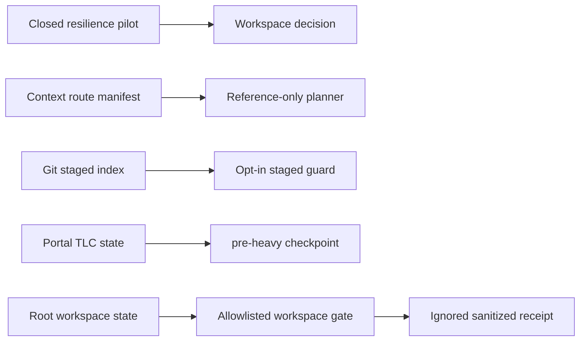

# Workspace Process Hardening Design

**Spec:** `.specs/features/workspace-process-hardening/spec.md`
**Status:** Approved

## Architecture Overview

The feature adds five small, local mechanisms around existing workspace contracts. Each mechanism
owns one lifecycle and remains read-only toward product repositories. The user approved the
recommended incremental approach instead of copying EDREN's monorepo-specific implementation.

## Code Reuse Analysis

| Existing component | Location | Reuse |
| --- | --- | --- |
| Sanitized cohort auditor | `scripts/audit-session-history.py` | Supplies the already validated closing aggregates; no transcript parser is added. |
| Pilot lifecycle contract | `scripts/test-session-resilience-contract.sh` | Extended from active-pilot assertions to exact closed-pilot assertions. |
| Workspace structural audit | `scripts/test-workspace-structure.py` | Extended to verify index completeness and links. |
| Atomic checkpoint writer | `scripts/update-tlc-checkpoint.py` | Adds one enum value without changing target resolution or write mechanics. |
| Aggregate gate | `scripts/test-workspace.sh` | Remains the canonical root gate and gains focused suites. |
| EDREN validated patterns | `scripts/ai-context.py`, `gate_evidence.py`, and local guardrails in `/root/lucas/edren/edren` | Used only as behavioral examples; implementation is workspace-native and smaller. |

## Components

### Pilot Closure

- **Purpose:** Freeze the post-baseline aggregate comparison and decision outcome.
- **Locations:** `.specs/features/workspace-session-resilience-v2/pilot.md`, `.specs/STATE.md`.
- **Dependencies:** Auditor contract v2 and existing AD-041.
- **Invariant:** No session identity, transcript location, command, or tool payload is persisted.

### Context Package Planner

- **Purpose:** Validate a versioned manifest and emit one deterministic reference-only route plan.
- **Locations:** `.specs/context/routes.json`, `scripts/workspace-context.py`.
- **Interface:** `workspace-context.py audit` and `workspace-context.py plan --route <name>`.
- **Dependencies:** Local project pointers, skills, and workspace indexes.
- **Invariant:** The planner reads metadata and filesystem existence only; it never emits referenced content.

### Workspace Information Indexes

- **Purpose:** Classify feature artifacts and route decision readers back to canonical `STATE.md`.
- **Locations:** `.specs/features/INDEX.md`, `.specs/DECISIONS.md`.
- **Invariant:** Indexes contain labels and links only. Tests derive completeness from canonical directories and decision entries.

### Staged Content Guard

- **Purpose:** Inspect the Git index for high-confidence local safety violations.
- **Locations:** `scripts/check-staged-content.py`, `.githooks/pre-commit`, `scripts/install-git-hooks.sh`.
- **Interface:** no arguments for normal use; tests may pass `--repo` to an isolated fixture.
- **Invariant:** Diagnostics contain paths and reason codes, never staged content.

### Portal Checkpoint Extension

- **Purpose:** Record a stable handoff immediately before a heavy stage.
- **Location:** `scripts/update-tlc-checkpoint.py`.
- **Invariant:** `pre-heavy` is only a new event label; all existing sanitization, path, and atomicity rules remain unchanged.

### Root Gate Evidence

- **Purpose:** Run one allowlisted profile and determine whether its latest result is reusable.
- **Locations:** `scripts/workspace-gate-evidence.py`, `session-context/runtime/workspace-gate-evidence-v1.json`.
- **Interfaces:** `run --profile workspace`, `status --profile workspace`.
- **State identity:** Hash of HEAD plus modes and content of tracked and non-ignored untracked files.
- **Contract identity:** Hash of the runner and allowlisted gate entrypoints.
- **Invariant:** The stored record contains only the closed schema in WPH-14. Writes are atomic, mode `0600`, and never follow symlinks.

## Error Handling Strategy

| Error | Handling | Outcome |
| --- | --- | --- |
| Invalid context manifest | Fail before output | Exit 2 with concise metadata-only diagnostic |
| Staged guard cannot inspect index | Fail closed | Exit 1 without staged content |
| Explicit hook installer run outside a Git worktree | Fail without changing configuration | Non-zero exit |
| Checkpoint validation failure | Preserve prior state | Existing error contract |
| Gate child failure | Persist latest failed receipt | Non-zero exit and older success invalidated |
| Receipt write failure | Preserve prior valid file | Distinct non-zero runner failure |
| State changes during gate | Persist `state-changed` | Receipt is not reusable |
| Receipt corruption or unsafe permissions | Ignore its claims | `rerun-required` |

## Risks & Concerns

| Concern | Location | Impact | Mitigation |
| --- | --- | --- | --- |
| Pre-existing Figma changes overlap `STATE.md`, `AGENTS.md`, and README | current worktree | Atomic commits could accidentally absorb unrelated work | Stage and inspect only feature hunks; verify each commit path and diff. |
| Active decisions and features can drift from indexes | `.specs/STATE.md`, `.specs/features/` | Readers may follow stale navigation | Root structural tests compare indexes to canonical entries and directories. |
| Secret detection can create false positives in tests | staged guard | Legitimate source could be blocked | Use high-confidence token shapes and construct fixture values without embedding real-looking tokens in versioned source. |
| Gate receipt could be mistaken for final validation | gate evidence | Stale evidence could promote unverified work | Instructions and status output limit reuse to immediate same-state continuation; fresh validation remains mandatory. |
| Fingerprinting while files change can bind a mixed snapshot | gate evidence | Incorrect reuse | Fingerprint before and after; state changes force `state-changed`. |

## Tech Decisions

| Decision | Choice | Rationale |
| --- | --- | --- |
| Delivery shape | Five sequential atomic tasks | Each mechanism has a distinct rollback and verification unit. |
| Manifest format | Closed-schema JSON | Stdlib parsing and deterministic ordering avoid dependencies. |
| Hook activation | Explicit installer | Versioning a hook does not silently mutate clone configuration. |
| Gate profile | Root workspace only | Preserves product repository ownership. |
| Receipt location | Ignored session runtime | Same-machine recovery without durable or canonical status. |
| Validation | Existing TLC verifier plus scratch mutations | Preserves evidence independence without changing dual-engine policy. |

No new external dependency or project-level technology choice is introduced. The scoped automation
authorization is recorded by the pilot-closing decision during T1.
